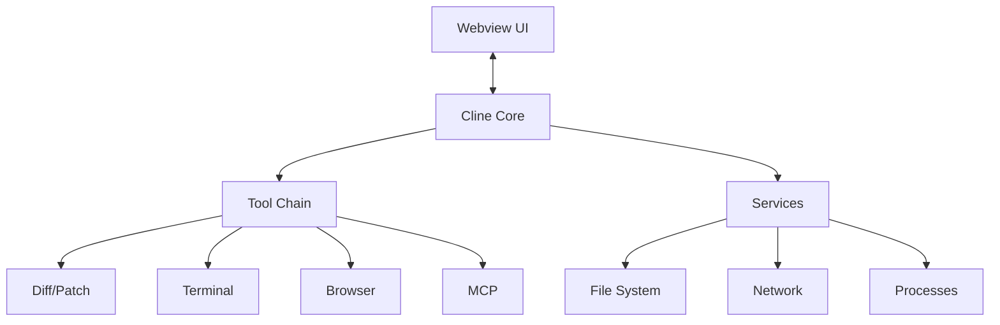

# Architecture

- **Webview UI**: User interface.
- **Cline Core**: Central controller.
- **Tool Chain**:
  - **Diff/Patch**: Virtual file editing with diffs and merging.
  - **Terminal**: Manages terminals for CLI execution. 
  - **Browser**: Interacts with web browsers.
  - **MCP**: Integrates external tools/services.
- **Services**:
  - **File System**: File operations.
  - **Network**: Network communication and APIs.
  - **Processes**: Spawns/manages external processes.
