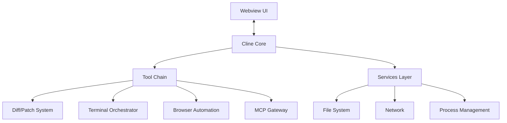
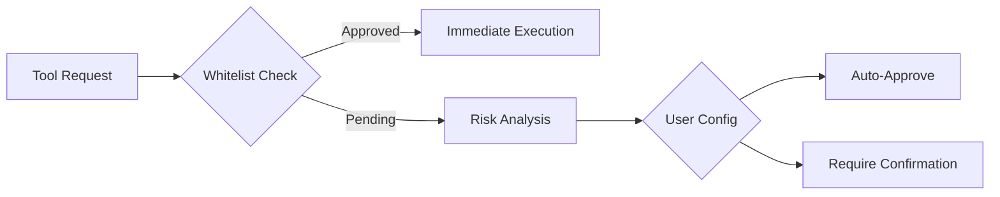

# Cline System Design Documentation

## 1. Architectural Blueprint



## 2. Component Architecture

Cline is a modular system composed of several key components that work together to provide a comprehensive coding assistant experience. The following sections provide an overview of the major components and their interactions.

### 2.1 Cline (Central Controller)

The `Cline` class serves as the central controller, orchestrating the overall task lifecycle, API communication, and integration with various subsystems. It is responsible for managing the state of the application, executing tasks, and coordinating the interactions between different components.

The `Cline` class interacts with the following key components:

- **DiffViewProvider**: Handles virtual file editing, previewing changes, and merging modifications.
- **TerminalManager**: Manages terminal instances, executes commands, and handles terminal output.
- **BrowserSession**: Provides browser automation capabilities, including launching, navigating, and performing actions within a browser instance.
- **CheckpointTracker**: Manages checkpoints and tracks workspace file changes, enabling state restoration and diff generation.
- **ApiHandlers**: Facilitates communication with various language model APIs, such as OpenAI, Anthropic, DeepSeek, and others.

For more detailed information about the `Cline` class and its implementation, please refer to the [Cline documentation](../components/Cline.md).

### 2.2 DiffViewProvider (File System Mediator)

The `DiffViewProvider` component is responsible for facilitating virtual file editing and managing the diff view experience within Visual Studio Code. It provides the following key functionalities:

- Opening files for editing and creating new files.
- Streaming content updates to the diff editor in real-time.
- Providing a side-by-side diff view, showing the original file content and the edited content.
- Handling merging of user edits with the original content.
- Detecting and reporting auto-formatting changes applied by the editor.
- Identifying and reporting new problems (e.g., linter errors) introduced by the changes.
- Saving the edited content to the file system or reverting changes if needed.

The `DiffViewProvider` interacts with other components like `DecorationController` to manage visual decorations in the editor. It also integrates with the file system and diagnostics services to read/write files and detect new problems after editing.

For more detailed information about the `DiffViewProvider` and its implementation, please refer to the [DiffViewProvider documentation](../components/DiffViewProvider.md).

### 2.3 TerminalManager

The `TerminalManager` component is responsible for managing terminal instances, executing commands, and handling terminal output within the Visual Studio Code environment. It provides the following key functionalities:

- Creating new terminal instances when needed.
- Reusing existing terminals if available, considering their current working directory and busy state.
- Executing commands in terminals and returning a `TerminalProcess` object.
- Supporting real-time output handling and background execution.
- Retrieving unretrieved output from ongoing or completed commands.
- Handling shell integration events for improved output handling.
- Tracking active terminals and their associated processes.
- Disposing of terminals and processes when no longer needed.

The `TerminalManager` works in conjunction with the `TerminalProcess` and `TerminalRegistry` classes to provide a comprehensive terminal management solution.

For more detailed information about the `TerminalManager` and its implementation, please refer to the [TerminalManager documentation](../components/TerminalManager.md).

### 2.4 BrowserSession

The `BrowserSession` component is responsible for managing a browser instance and providing browser automation capabilities within the Visual Studio Code environment. It provides the following key functionalities:

- Launching a new browser instance with specified configurations (e.g., user agent, viewport, headless mode).
- Ensuring the availability of the required Chromium executable.
- Navigating the browser to a specified URL.
- Waiting for the page to fully load and stabilize.
- Performing actions on the browser, such as clicking, typing, scrolling, and capturing screenshots.
- Handling network activity and page navigation resulting from actions.
- Closing the browser instance and cleaning up resources.

The `BrowserSession` class interacts with the Puppeteer library to control the browser instance and perform various automation tasks.

For more detailed information about the `BrowserSession` and its implementation, please refer to the [BrowserSession documentation](../components/BrowserSession.md).

### 2.5 CheckpointTracker

The `CheckpointTracker` component is responsible for managing checkpoints and tracking workspace file changes within the Visual Studio Code environment. It provides the following key functionalities:

- Creating a shadow Git repository to track workspace file changes.
- Initializing the shadow Git repository with appropriate configurations and exclusions.
- Committing changes to the shadow Git repository, creating checkpoints.
- Resetting the workspace to a specific checkpoint by resetting the shadow Git repository to the corresponding commit.
- Handling untracked files, staged changes, and merge conflicts during restoration.
- Generating diffs between checkpoints or between a checkpoint and the current workspace state.
- Providing the before and after content of changed files.
- Ensuring that checkpoints are only used within the original workspace directory.
- Preventing the use of checkpoints in certain system directories (e.g., Desktop, Documents, Downloads).

The `CheckpointTracker` class interacts with the simple-git library to manage the shadow Git repository and perform checkpoint-related operations.

For more detailed information about the `CheckpointTracker` and its implementation, please refer to the [CheckpointTracker documentation](../components/CheckpointTracker.md).

### 2.6 ApiHandlers

Cline supports communication with various language model APIs through a set of ApiHandler components. These components implement the `ApiHandler` interface and provide an interface for sending requests and receiving responses from their respective APIs.

The following ApiHandler components are available:

- **OpenAiHandler**: Handles communication with the OpenAI API.
- **AnthropicHandler**: Handles communication with the Anthropic API.
- **AwsBedrockHandler**: Handles communication with the Anthropic Bedrock API hosted on AWS.
- **DeepSeekHandler**: Handles communication with the DeepSeek API.
- **GeminiHandler**: Handles communication with the Google Gemini API.
- **LmStudioHandler**: Handles communication with the LM Studio API.
- **MistralHandler**: Handles communication with the Mistral AI API.
- **OllamaHandler**: Handles communication with the Ollama API.
- **OpenAiNativeHandler**: Handles communication with the OpenAI API (native).
- **OpenRouterHandler**: Handles communication with the OpenRouter API.
- **VertexHandler**: Handles communication with the Anthropic Vertex AI API.
- **VsCodeLmHandler**: Handles communication with the Visual Studio Code Language Model API.

Each ApiHandler component provides methods for sending requests, handling responses, and retrieving model information specific to its respective API. The `Cline` class interacts with these ApiHandler components to facilitate communication with the language model APIs.

For more detailed information about each ApiHandler component and its implementation, please refer to the respective documentation files in the [ApiHandlers documentation](../components/ApiHandlers.md).

[See full component interaction diagram](component-interaction-diagram.md)

## 3. Critical Data Flows

### 3.1 Tool Execution Pipeline
```typescript
interface ToolExecutionResult {
  success: boolean;
  output: string;
  requiresCommit: boolean;
  rollbackHandler?: () => Promise<void>;
}

async executeTool(tool: Tool): Promise<ToolExecutionResult> {
  // 1. Validate parameters
  // 2. Check permissions
  // 3. Execute in sandbox
  // 4. Stage changes
  // 5. Return verifiable result
}
```

## 4. Safety Systems

### 4.1 Auto-Approval Engine


### 4.2 Checkpoint System
```typescript
interface Checkpoint {
  id: string;
  timestamp: number;
  state: {
    files: FileSnapshot[];
    env: EnvironmentState;
    conversation: EncryptedConversationState;
  };
  differential: ChangeSet;
}

async createCheckpoint(): Promise<Checkpoint> {
  // 1. Pause all operations
  // 2. Capture file hashes
  // 3. Serialize conversation state
  // 4. Generate differential patch
  // 5. Resume operations
}
```

[Continue to Security Model](security-model.md)
