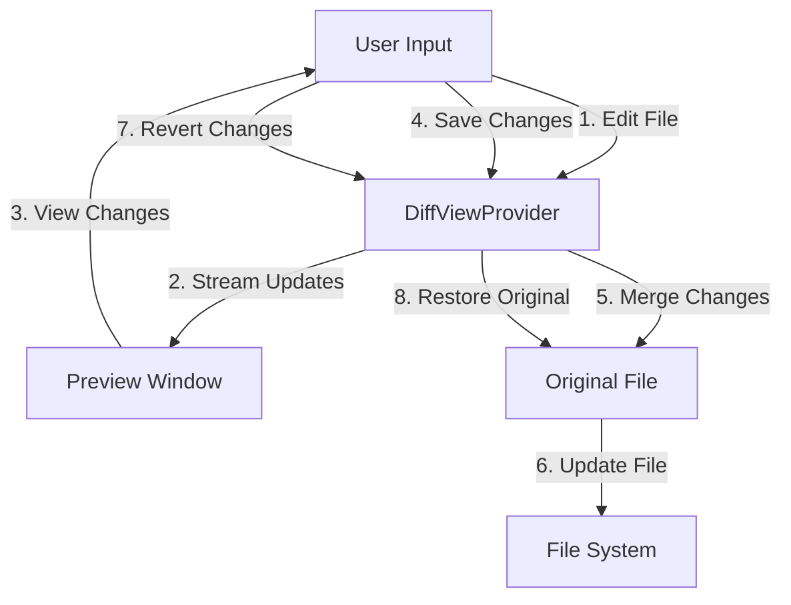

# Virtual File Editing and Diff Handling

Cline's virtual file editing capabilities are implemented primarily through the following components:

- **DiffViewProvider** (src/integrations/editor/DiffViewProvider.ts)
  - Facilitates making changes to files in a virtual environment.
  - Provides real-time previews and handles three-way merges.

- **DecorationController** (src/integrations/editor/DecorationController.ts)
  - Manages file decorations, which are visual indicators applied to the editor.

- **detect-omission** (src/integrations/editor/detect-omission.ts)
  - Contains utility functions for detecting potential code omissions when editing files.

The `DiffViewProvider` is the central component responsible for the virtual file editing experience. It handles opening files for editing, streaming content updates, saving and merging changes, and reverting changes if needed.

The `DecorationController` and `detect-omission` module provide supporting functionality for managing file decorations and identifying potential code omissions, respectively.

For a high-level overview of the virtual file editing workflow, refer to the following diagram:

1. The user initiates a file edit through the Cline interface.
2. The `DiffViewProvider` streams the changes to a preview window.
3. The user can view the changes in real-time and make further edits if needed.
4. When the user decides to save the changes, the `DiffViewProvider` is responsible for merging the changes.
5. The `DiffViewProvider` performs a three-way merge between the virtual file changes, the original file, and any external changes.
6. The merged changes are applied to the file in the file system.
7. If the user decides to revert the changes, the `DiffViewProvider` is instructed to discard the changes.
8. The `DiffViewProvider` restores the original file state.

Throughout this process, the `DecorationController` manages file decorations to highlight specific lines or sections of code, while the `detect-omission` module helps identify potential code omissions to prevent unintended deletions or modifications.

For more detailed information on the implementation of these components and their interactions with other parts of the system, please refer to the respective source code files and documentation comments.
